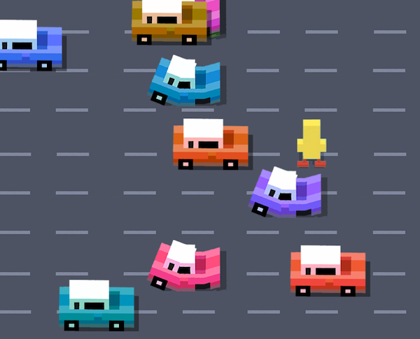

## Building a DOM game with HTML Custom Elements

This is a small experiment showing how to invent your own HTML Elements to build a game in the DOM.



### What are these custom elements?

A custom element is an HTML Element that allows you to add your own properties and methods. For example, the basic [HTMLElement](https://developer.mozilla.org/en/docs/Web/API/HTMLElement) has a `style` property and a `click()` method. By extending the HTML Element we get all this existing functionality and we can add our own.

In this experiment we have an element `Car` that has an `x` and `y` property and an `update()` method:

```
class Car extends HTMLElement {

    public x: number;
    public y: number;

    constructor(){
        super();
        console.log("A car was created!");
    }

    public update(): void {
        console.log("The car's update method was called!");
    }
}
```
Before we can add our Car element to the DOM, we have to register it, connecting our class to a HTML tag. Note that the html tag needs to contain a hyphen:
```
window.customElements.define("car-component", Car);
```

Now you can add cars to the dom by placing tags:
```
<body>
    <car-component></car-component>
</body>
```

In our game we prefer to add cars by code. We can create a new instance of `Car` and add it to the DOM in one line:
```
document.body.appendChild(new Car());
```

This will result in a `<car-component></car-component>` being added to your HTML structure, and the message `A car was created!` will appear in the console. This HTML Element will have an `x` and `y` property and an `update()` method.

### DOM manipulation

You can query your HTML document for car components, and use the new `for of` loop to call their `update()` method.
```
let cars : NodeListOf<Car> = document.getElementsByTagName("car-component") as NodeListOf<Car>;

for(let c of cars){
    c.update();
} 
```

### Lifecycle

A custom element has lifecycle hooks: these methods get called automatically when the Car is added to, or removed from, the DOM.
```
class Car extends HTMLElement {

    public connectedCallback(): void {
        console.log("A car was added to the DOM");
    }

    public disconnectedCallback():void{
        console.log("hey! someone removed me from the DOM!");
    }
}
```

### Game Loop

Our game class will create a player element and start the game loop. A game loop updates our game elements 60 times per second using `requestAnimationFrame`. 

- The game loop will add a `new Car()` to the DOM every second by using the modulo operator.
- The game loop will find all `<car-component>` tags and call their update method.

The game is instantiated with `new Game()` after window.load. Note that the Game class itself doesn't need to extend HTMLElement.

```
class Game {
    
    private counter:number = 0;
     
    constructor() {
        document.body.appendChild(new Player());
        requestAnimationFrame(() => this.gameLoop());
    }
    
    private gameLoop(){
        this.counter++;
        if(this.counter%60 == 0) {
            document.body.appendChild(new Car());
        }

        let cars : NodeListOf<Car> = document.getElementsByTagName("car-component") as NodeListOf<Car>;

        for(let c of cars){
            c.update();
        } 

        requestAnimationFrame(() => this.gameLoop());
    }
}

window.addEventListener("load", function() {
    new Game();
});
```

### Removing cars

When a car leaves the screen or hits the player, we can easily remove it. Since the car extends from HTMLElement we can use the `remove()` method, which removes it from the DOM. The game loop won't call the update method anymore, and if we want, we could use the `disconnectedCallback()` to execute some final code before the car is completely removed.

```
public disconnectedCallback():void{
    console.log("the car is removed from the game!");
}

public update(): void {
    this.x += this.speed;

    if (this.x > window.innerWidth) {
        this.remove();
    }
}
```

### Styling and animation

Note that the styling of our custom elements is entirely done in CSS. First we declare that ALL document elements are going to use `position:absolute`, and then we declare a size and a background image for each individual element:

```
body * {
    position: absolute;
    display: block;
    margin:0px; padding:0px;
    box-sizing: border-box;
    background-repeat: no-repeat;
}

car-component {
	width:168px; height:108px;
	background-image: url('../images/car.png');
}
```

We position our elements using `css transform`, so that we can use the GPU for smooth animation.

```
this.style.transform = `translate(${this.x}px, ${this.y}px)`;
```

### Extending other elements

This example only uses `extends HTMLElement`, but we could also extend a `HTMLDivElement`, `HTMLButtonElement`, etc. In this example, all our elements are treated as `<div>` by simply setting `display:block` in the CSS.

### Typescript

This experiment is built with Typescript, but you can easily rebuild it in pure Javascript by removing the type information. You can check the `main.js` file to see the Javascript equivalent. 

To compile this project you can install Typescript with `npm install -g typescript`, and then type `tsc -p` in the terminal in the project folder.

### For of loop in NodeList

The `for of` loop is not yet supported for `NodeList` and `HTMLCollection` in Safari and Firefox, because they are technically not arrays. Enable it with:

```
NodeList.prototype[Symbol.iterator] = Array.prototype[Symbol.iterator];
HTMLCollection.prototype[Symbol.iterator] = Array.prototype[Symbol.iterator];
```